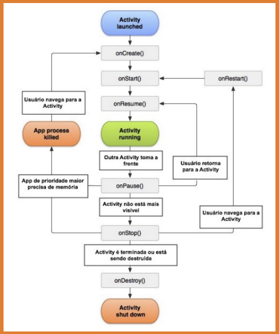

## Activity

A Activity é um componente no Android que representa a tela do Aplicativo, onde teremos itens para
interação como: textos, botões, menus, listas, entre outros.

Em uma tela de aplicativo temos a "Classe Kotlin" exemplo:

```
class MainActivity : AppCompatActivity() {...}
```

e o "Arquivo XML" com o design desta tela, com textos e botões por exemplo. Juntando a classe
com o arquivo XML temos uma Activity.

### Navegação entre Activities

Pilha de Activities: conforme você for abrindo activities, elas vão ficando uma sobre a outra,
criando uma pilha de activities.

Utilizamos o método startActivity para abrir uma nova tela, para isso é necessário passar como
parâmetro um objeto Intent.

startActivity ( Intent ) -> Intent: Intenção(resolve ou faz alguma coisa).

Intent(contexto, classe) -> Contexto: contexto que será executado; Classe: activity que será aberta.

O contexto é um ponto de acesso para informações globais do seu App. Vamos ao exemplo de uma casa:
Se fala para abrir a JANELA, o contexto seria o cômodo, janela da Sala? da Cozinha? qual o contexto?

Em muitos dos casos o contexto será a activity que será executada a ação.

### Ciclo de vida de uma Activity

<div align="center">
  
</div>

### Métodos de ciclo de vida de uma Activity

- onCreate

O onCreate() é o primeiro método a ser chamado, responsável pela criação da activity e é executado
uma só vez, até a Activity ser destruída. É nessa etapa que são realizados configurações que
precisem ser executadas uma única vez, exemplo: criação de Layout. Após o onCreate() concluir sua
execução, o sistema chama o método onStart().

- onStart

O onStart() é executado logo após o onCreate() e define que a activity está em processo de
inicialização, tornando a activity visível para o usuário. Esse método é executado rapidamente e,
finalizada essa etape a Activity passa para a próxima etapa.

- onResume

O onResume() é o que efetivamente deixa o Aplicativo pronto para uso, permitindo interação com o
usuário. Nesse estado é possível também ativar funcionalidades que precise operar, por exemplo
iniciar a câmera. Nesse estado, a Activity fica na parte superior da pilha de navegação e captura
toda interação com o usuário, ficando nesse estado até que o usuário sai da tela.

- onPause

Agora se o usuário estiver usando o App e receber uma ligação telefônica a Activity não estará mais
100% em foco para o usuário, a ligação irá sobrepor o App e o método onPause() é chamado e estando
nesse estado, poderá seguir dois caminhos possíveis:

```
onStop() caso fique totalmente invisível para o usuário;
onResume() caso volte ao foco;
```

- onStop

O método onStop() é chamado quanto a Activity fica completamente invisível para o usuário, nesse
estado o aplicativo pode liberar ou ajustar recursos que não precisam estar disponíveis enquanto a
Activity não estiver visível, por exemplo pausar vídeo, animações, processamento que não será
necessário caso o usuário não esteja visualizando a tela.

- onRestart

Esse método é chamado quando a Activity sai do estado de pausado onPause() ou de interrompido
onStop() e volta a ser utilizada. O método onRestart() é sempre seguido do onStart(), iniciando
novamente o ciclo.

- onDestroy

O método onDestroy() é chamado quando a Activity será destruída e isso pode acontecer se o usuário
encerrar o aplicativo ou quando ocorre uma mudança de configuração como rotação da tela.

### Passando e Recuperando dados entre activities

Aproveitando a intent de abrir uma nova activity, podemos passar dados da seguinte forma:

```kotlin
val intent = Intent(this, SegundaActivity::class.java)
intent.putExtra("filme", "The Witcher")
intent.putExtra("classificacao", 5)
intent.putExtra("avaliacoes", 9.2)
```

E para resgatar esses dados, podemos utilizar:

```kotlin
val bundle = intent.extras
if(bundle != null) {
	val filme = bundle.getString("filme")
	val classificacao = bundle.getInt("classificacao")
	val avaliacoes = bundle.getDouble("avaliacoes")
}
```

### Passando Objetos entre activities

É realizado através da serialização que significa salvar o estado atual do objeto em formato
binário, podendo ser recuperado esse estado posteriormente. Esse processo é feito de 2 maneiras:

```
Interface Serializable;
kotlin-parcelize (plugin) -> Recomendado;
```

- Interface Serializable

```kotlin
// Classe Filme
import java.io.Serializable

data class Filme() {
	val nome: String
} : Serializable

// Classe MainActivity
val intent = Intent(this, DetalhesActivity::class.java)

// Passando o Filme pra Intent
val filme = Filme("O Todo Poderoso")
intent.putExtra("filme", filme)

// Na segunda tela:
val filme = if (Build.VERSION.SDK_INT >= Build.VERSION_CODES.TIRAMISU) {
	bundle.getSerializable("filme", Filme::class.java)
} else {
	bundle.getSerializable("filme") as Filme
}
```

- kotlin Parcelize (Plugin)

```kotlin
// Adicione no build.gradle.kts (Module: App):
// plugins {
//   ...
//   id("kotlin-parcelize")
// }

// Classe Filme
import android.os.Parcelable
import kotlinx.parcelize.Parcelize

@Parcelize
data class Filme() {
	val nome: String
} : Parcelable

// Classe MainActivity
val intent = Intent(this, DetalhesActivity::class.java)

// Passando o Filme pra Intent
val filme = Filme("O Todo Poderoso")
intent.putExtra("filme", filme)

// Na segunda tela:
val filme = if (Build.VERSION.SDK_INT >= Build.VERSION_CODES.TIRAMISU) {
    bundle.getParcelable("filme", Filme::class.java)
} else {
    // Método DEPRECIADO
    bundle.getParcelable("filme")
}
```

## Fragment

Representa uma parte reutilizável da interface de usuário do seu App. Um fragment define e gerencia
o próprio layout, tem o próprio ciclo de vida e pode processar eventos de entrada. Fragments não
existem por conta própria, eles precisam ser hospedados por uma Activity ou outro Fragment.

### Criação de Fragment

Vamos criar uma estrutura com Fragment em 2 etapas:

- Programaticamente

Primeiro devemos criar a classe do Fragment :
Botão direito na pasta desejada;
Clica em New;
Clicar em Fragment;
E por fim em Fragment (Blank);

Desta forma será criado um Fragment com as configurações iniciais do Android. Mas você poderá criar
um fragment do 0 também, exemplo:

Criei uma nova Kotlin Class File e configure da seguinte forma:

```kotlin
// Após criar a classe, deve-se herdar de Fragment e instanciar o Pai(Fragment)
class ConversasFragment : Fragment() {
	override fun onCreateView(
		inflater: LayoutInflater,
		container: ViewGroup?,
		savedInstanceState: Bundle?
	): View? {
		//return supoer.onCreateView(inflater, container, savedInstanceState)
		return inflater.inflate(
			R.layout.fragment_teste, // R do seu projeot
			container,
			false // AttachToRoot
		)
	}
}
```

Crie um Layout Resource File para criar o Layout do Fargment.

- Usando o XML

Após ter criado a Classe (Fragment), no Layout que irá receber o fragment, deve-se usar o
Componenete FragmentContainerView (e coloque o ID, nesse exemplo vou colocar de fragment_conteudo)
pois vai ser usado no tema abaixo de Navegando entre Fragments, arraste ele pra tela e configure da
forma que precisar.

### Navegando entre Fragments

No seu arquivo principal (geralmente MainActivity):

Usar o supportFragmentManager que retorna o objeto que nos permite manipular os Fragments
e usar o .beginTranscation() para começar a transação (inicializa as alterações que você pode fazer
em um Fragment)

Forma Padrão:

```kotlin
val fragmentManager = supportFragmentManager.beginTransaction()

// Diversas alterações em fragment
val conversasFragment = ConversasFragment()
fragmentManager.add(R.id.fragment_conteudo, conversasFragment)

fragmentManager.commit()
```

Forma simplificada:

```kotlin
supportFragmentManager
	.beginTransaction()
	//.add(R.id.fragment_conteudo, ConversasFragment())
	//.remove(conversasFragment) // Deve ter sido instânciado antes
	.replace(R.id.fragment_conteudo, ConversasFragment())
	.commit()
```
