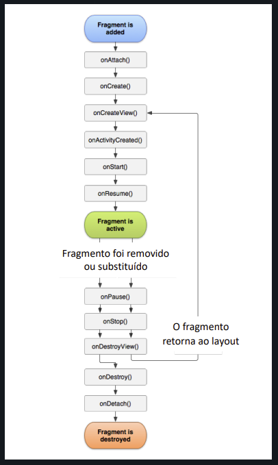
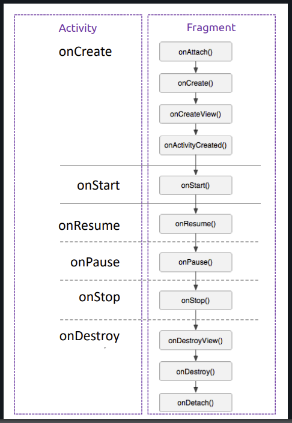

## Fragment

Representa uma parte reutilizável da interface de usuário do seu App. Um fragment define e gerencia
o próprio layout, tem o próprio ciclo de vida e pode processar eventos de entrada. Fragments não
existem por conta própria, eles precisam ser hospedados por uma Activity ou outro Fragment.

### Ciclo de vida de um Fragment

<div align="center">
  
</div>

### Ciclo de vida de um Fragment vs Activity

<div align="center">
  
</div>

### Criação de Fragment

Vamos criar uma estrutura com Fragment em 2 etapas:

- Programaticamente

Primeiro devemos criar a classe do Fragment :
Botão direito na pasta desejada;
Clica em New;
Clicar em Fragment;
E por fim em Fragment (Blank);

Desta forma será criado um Fragment com as configurações iniciais do Android. Mas você poderá criar
um fragment do 0 também, exemplo:

Criei uma nova Kotlin Class File e configure da seguinte forma:

```kotlin
// Após criar a classe, deve-se herdar de Fragment e instanciar o Pai(Fragment)
class ConversasFragment : Fragment() {
	override fun onCreateView(
		inflater: LayoutInflater,
		container: ViewGroup?,
		savedInstanceState: Bundle?
	): View? {
		//return supoer.onCreateView(inflater, container, savedInstanceState)
		return inflater.inflate(
			R.layout.fragment_teste, // R do seu projeot
			container,
			false // AttachToRoot
		)
	}
}
```

Crie um Layout Resource File para criar o Layout do Fargment.

- Usando o XML

Após ter criado a Classe (Fragment), no Layout que irá receber o fragment, deve-se usar o
Componenete FragmentContainerView (e coloque o ID, nesse exemplo vou colocar de fragment_conteudo)
pois vai ser usado no tema abaixo de Navegando entre Fragments, arraste ele pra tela e configure da
forma que precisar.

### Navegando entre Fragments

No seu arquivo principal (geralmente MainActivity):

Usar o supportFragmentManager que retorna o objeto que nos permite manipular os Fragments
e usar o .beginTranscation() para começar a transação (inicializa as alterações que você pode fazer
em um Fragment)

Forma Padrão:

```kotlin
val fragmentManager = supportFragmentManager.beginTransaction()

// Diversas alterações em fragment
val conversasFragment = ConversasFragment()
fragmentManager.add(R.id.fragment_conteudo, conversasFragment)

fragmentManager.commit()
```

Forma simplificada:

```kotlin
supportFragmentManager
	.beginTransaction()
	//.add(R.id.fragment_conteudo, ConversasFragment())
	//.remove(conversasFragment) // Deve ter sido instânciado antes
	.replace(R.id.fragment_conteudo, ConversasFragment())
	.commit()
```
