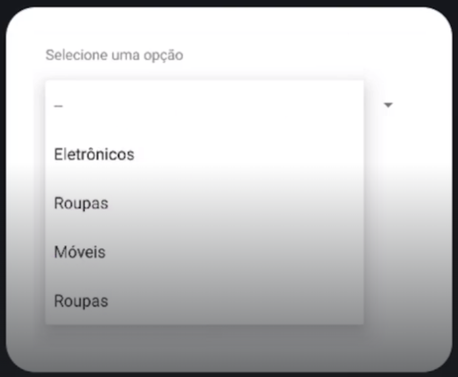

## Spinner

### Introdução

É um componente visual que permite selecionar um valor de um conjunto de dados.
<div align="center">
  
</div>

Para tratar os cliques individuais em cada item, precisamos usar a interface 
AdapterView.OnItemSelectedListener;
- selectedItem: recupera o texto do item selecionado;
- selectedItemPosition: recupera a posição do item selecionado;

### Criação

Vamos ver como criar um Spinner por etapas.

#### 1º Etapa

Crie o Spinner no XML, no menu lateral (Palette), o Spinner fica em Containers, arraste e o coloque 
onde quiser na tela.

#### 2º Etapa

Configurar o Spinner no código:
```kotlin
// Método chamado para Capturar o Item selecionado do Spinner
private fun spinnerSelecionarItem() {
	val itemSelecionado = binding.spinnerCategorias.selectedItem
	val itemPosicao = binding.spinnerCategorias.selectedItemPosition
	
	binding.textResultado.text = "Selecionado: $itemSelecionado / pos: $itemPosicao"
}

// Função para carregar e exibir o Spinner
private fun spinnerExibicao() {

	// É possível fazer a lista no strings.xml
	/*
	<resources>
		<string-array name="categorias">  
		    <item>Selecione uma categoria</item>  
		    <item>Eletrônicos</item>  
		    <item>Roupas</item>  
		    <item>Móveis</item>  
		    <item>Casa &amp; Construção</item>  
		</string-array>
	</resources>
	*/

	// Para recuperar as strings do XML
	// val categorias = resources.getStringArray(R.array.categorias)

	val categorias = listOf(
		"Selecione uma categoria",
		"Eletrônicos", "Roupas", "Móveis", "Roupas"
	)

	binding.spinnerCategorias.adapter = ArrayAdapter<String>(
		this, // Context
		android.R.layout.simple_spinner_dropdown_item, // Layout do próprio Android
		categorias // Lista com as opções
	)

	// Forma mais curta de criar o Adapter: (Ao usar o array em Strings)
	binding.spinnerCategorias.adapter = ArrayAdapter.createFrinResource(
		this,
		R.array.categorias,
		android.R.layout.simple_spinner_dropdown_item
	)

	// Utilizando o AdapterView.OnItemSelectedListener
	// vem de android.widget
	binding.spinnerCategorias.onItemSelectedListener = object : OnItemSelectedListener {
		// Implemente os 2 métodos
		override fun onItemSelected(
			parent: AdapterView<*>?,
			view: View?,
			position: Int,
			id: Long
		) {
			// Código aqui....
			//val itemSelecionado = parent?.getItemAtPosition(position)
			val itemSelecionado = parent?.selectedItem
			val binding.textResultado.text = itemSelecionado.toString()
		}

		override fun onNothingSelected(parent: AdapterView<*>?) {
			// Código aqui
		}
	}
}
```
