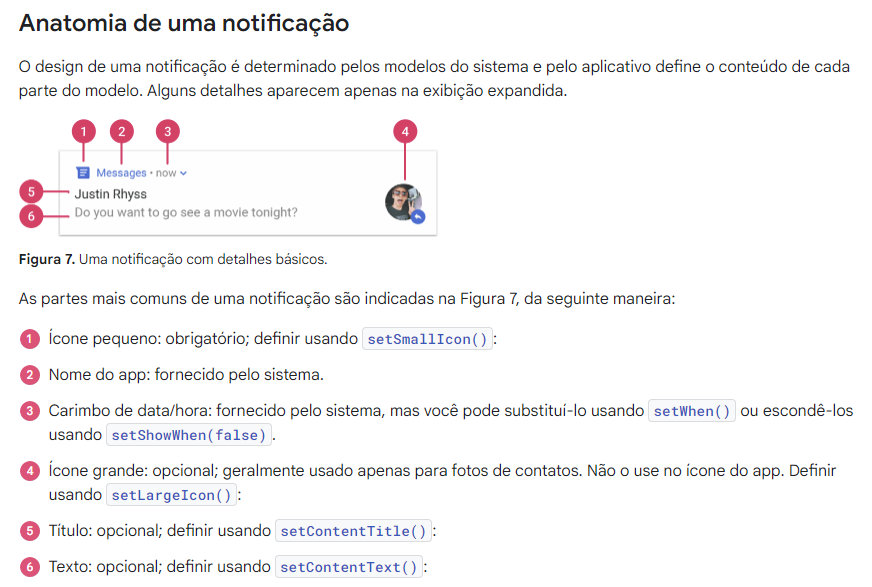

## Notificação

Uma notificação é uma mensagem que o Android exibe fora da interface do seu app para fornecer ao 
usuário lembretes, comunicações de outras pessoas ou outros informações oportunas do seu app. Os 
usuários podem tocar na notificação para abrir seu ou realizar uma ação diretamente da notificação.

<div align="center">
  
</div>

### Permissão

É necessário declarar a permissao POST_NOTIFICATION no arquivo de manifesto do app:
```xml
<manifest ...>
    <uses-permission android:name="android.permission.POST_NOTIFICATIONS"/>
    <application ...>
        ...
    </application>
</manifest>
```

### Canal de Notificação

A partir do Android 8.0 (API de nível 26), todas as notificações devem ser atribuídas a um canal ou 
não serão exibidos. Isso permite que os usuários desativem notificações específicas canais do seu app 
em vez de desativar todas as notificações.

É necessário criar um canal para as notificações, (recomendado na classe Application, utilizada
por exemplo para executar ações uma única vez, como criar o canal da notificação). Exemplo de criação 
de um canal de notificação na classe Application:
```kotlin
class CustomApplication : Application() {
	override fun onCreate() {
		criarCanais()
	}

	fun criarCanais() {
		val idCanal = "notificacaoLembrete"
		if(Build.VERSION.SDK_INT >= Build.VERSION_CODES_O) {
			val canal = NotificationChannel(
				idCanal,
				"Lembrete",
				NotificationManager.IMPORTANCE_HIGH
			)

			/*
			val notificationManager = getSystemService(NotificationManager::class.java)
			*/
			
			getSystemService(NotificationManager::class.java)
				.createNotificationChannel(canal)
				/*
					Criar vários canais
					.createNotificationChannels(
						listOf(
							canal1,
							canal2,
							canal3
						)
					)
				*/
		}
	}
}
```

Dentre as importâncias do Canal de Notificação, temos as mais utilizadas:
- IMPORTANCE_HIGH: aparece em destaque e faz som;
- IMPORTANCE_DEFAULT: aparece em destaque mas não faz som;
- IMPORTANCE_LOW: vai aparecer mas sem importância e sem som;