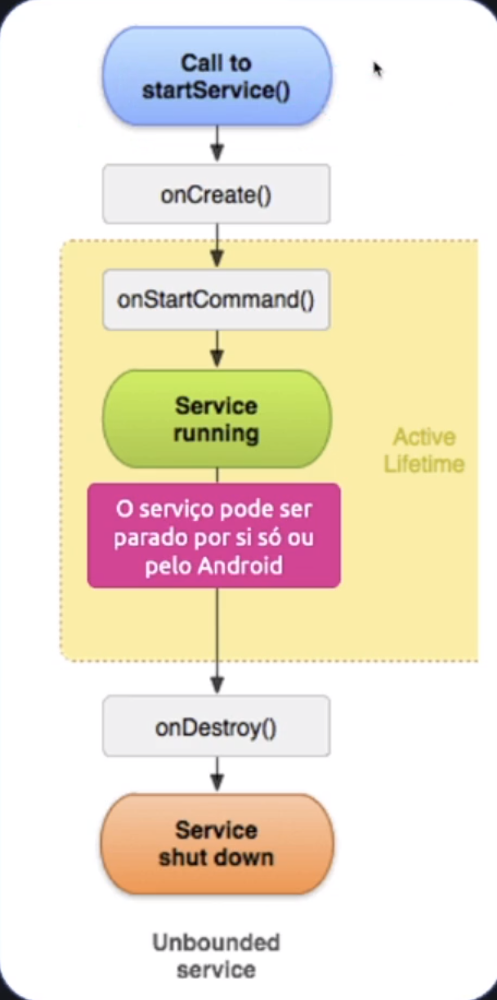

## Services

Service (Serviço) é o componente do aplicativo que pode realizar operações longas e algumas
operações que rodam mesmo o aplicativo estando fechado, e não fornece uma interface de usuário.

O Serviço é criado na Thread Principal, mas é possível criar uma Thread separada para execução do
serviço, se o serviço for realizar operações intensivas ou de bloqueio, para não sobrecarregar a
Thread Principal.

  

 

### Tipos de Services

- [Background Services](./background/Overview.md).

- [Foreground Services](./foreground/Overview.md).
