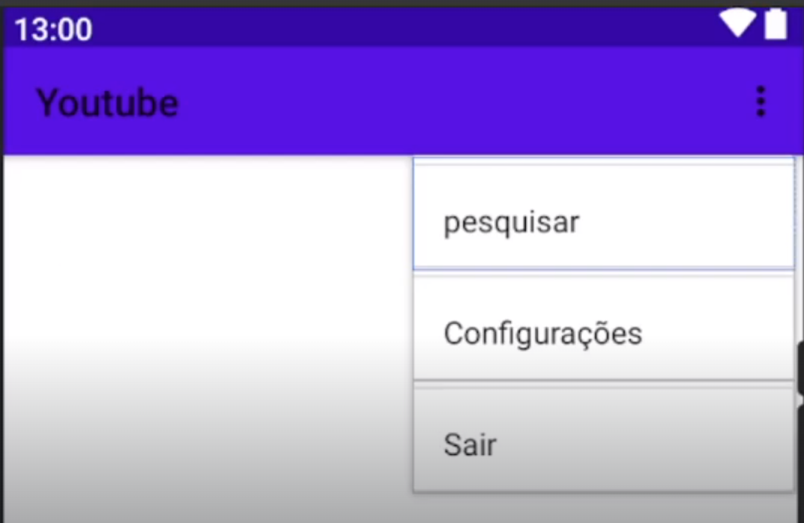
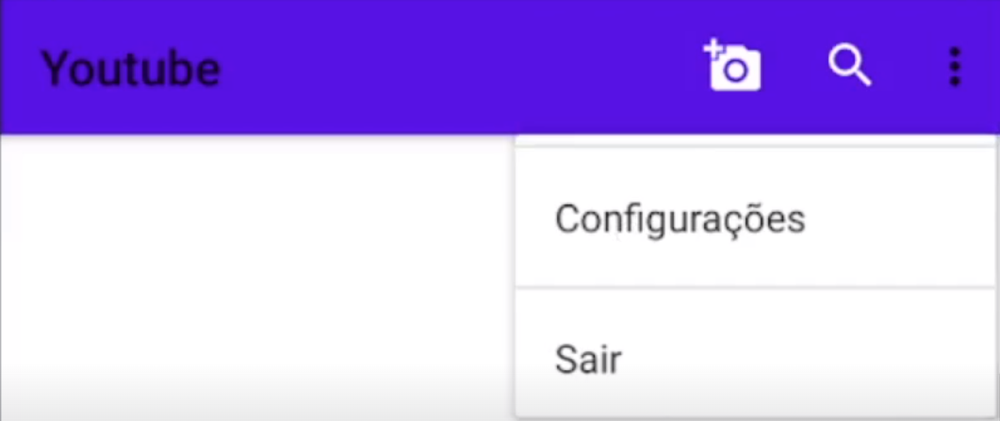

## Toolbar

### Introdução

A ToolBar permite mais customizações do que uma ActionBar.

### Criação do Menu (Arquivo XML)

Vamos criar o Menu seguindo os passos:
- Botão direito na pasta res;
- Clicar em New e clique em Android Resource Directory;
- Em "Resource type" selecione menu;
- Em "Directory Name" você pode mudar ou manter menu;

Após ter criado o Menu:
- Botão direito no diretório criado (menu);
- Clicar em New e depois em Menu Resource File;
- Coloque o nome do seu arquivo de menu, exemplo: menu_principal;
- Observação: Na sua aplicação você pode ter diversos menus;
- Após colocar o File name, clique em OK;

### Criação do Menu (Layout)

Abra o arquivo recem criado nome_do_menu.xml, no Palette terá opções de menu, no nosso exemplo, 
arraste um Menu Item e solte em qualquer lugar da tela, assim será criado um Menu Item, coloque 
mais 2 Menu Item. Crie seus respectivos nomes e id's, exemplo:
- Menu Item(1)
  - id: itemPesquisar
  - title: Pesquisar
- Menu Item(2)
  - id: itemConfiguracoes
  - title: Configurações
- Menu Item(3)
  - id: itemSair
  - title: Sair

Resultando em algo do tipo:
<div align="center">
  
</div>

Vamos configurar um Ícone, adicione um novo Menu Item e encontre Icon no menu lateral "Attributes" 
em "Common Attributes"
- Clique no Icon e adicione o ícone desejado;

Você vai perceber que o ícone não vai aparecer ainda, pois eles aparecendo quando é utilizado na 
área de cima (entre o "Youtube" e os "3 pontinhos") que é a barra de navegação. Para fazer com que o 
ícone apareça, você deve clicar na bandeirinha em showAsAction e selecionar uma das opções a seguir:
- always: ele aparece sempre na barra de navegação;
- never: ele nunca aparece na barra de navegação;
- ifRoom: se tiver espaço ele aparece na barra de navegação, se não ele fica em baixo mesmo;
- withText: inclui também o texto do Título com o ícone;

Colocando ícones e fazendo as configurações acima nos itens de:
- Perfil;
- Pesquisar;

Ficaria algo do tipo:
<div align="center">
  
</div>

### Adicionando o Menu a ToolBar

Na activity principal da tela que deseja usar o Toolbar:
```kotlin
override fun onCreate(...) {
	// Código do onCreate
}

override fun onCreateOptionsMenu(menu: Menu?): Boolean {
	//return super.onCreateOptionsMenu(menu)
	// É necessário inflar(construir) o menu
	menuInflater.inflate(
		R.menu.menu_principal, // Arquivo XML do Menu criado
		menu // Parâmetro que a função já tem
	)
	return true
}
```

O código acima carrega o Menu na tela, mas os itens do menu ainda não são clicáveis, é necessário 
utilizar outro método para aplicar as ações de cliques em cada um dos Itens:
```kotlin
// Ao selecionar um Item no Menu
override fun onOptionsItemSelected(item: MenuItem): Boolean {
	//return super.onOptionsItemSelected(item)
	when(item.itemId) {
		R.id.itemPesquisar -> {
				// Código do item Pesquisar
			}
		R.id.itemConfiguracao -> {
			// Código do item Configuração
		}
		R.id.itemSair -> {
			// Código do item Sair
		}
	}
	
	return true
}
```
