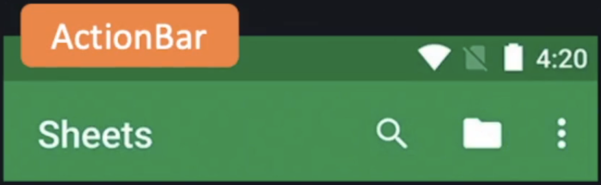
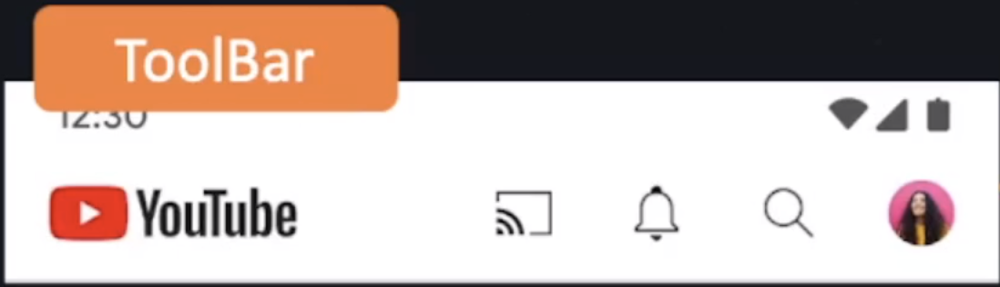

## Componentes de Interface

### Toast

Como criar um Toast:
```kotlin
import android.widget.Toast

Toast.makeText(
	this,
	"Mensagem aqui",
	Toast.LENGTH_LONG
).show()
```

Veja mais sobre Toast [clicando aqui](GuideToast.md).

### Snackbar

Como criar uma Snackbar:
```kotlin
import com.google.android.material.snackbar.Snackbar

val snackbar = Snackbar.make(
	view,
	"Mensagem aqui",
	Snackbar.LENGTH_SHORT
)
```

Veja mais sobre Snackbar [clicando aqui](GuideSnackbar.md).

### Alert Dialog

Como criar um AlertDialog:
```kotlin
AlertDialog.Builder(this)
	.setTitle("Titulo")
	.setMessage("Mensagem")
	.setNegativeButton("nome botão") {dialog, posicao -> 
		// código a ser executado quando clicar no botão negativo
	}
	.setPositiveButton("nome botão") {dialog, posicao -> 
		// código a ser executado quando clicar no botão positivo
	}
	.setCancelable(false) // Obriga a selecionar uma opção
	.create()
	.show()
```

Veja mais sobre AlertDialog [clicando aqui](GuideAlertDialog.md).

### Spinner

Como criar um Spinner:
```kotlin
private fun spinnerSelecionarItem() {  
    val itemSelecionado = binding.spinnerCategorias.selectedItem  
    val itemPosicao = binding.spinnerCategorias.selectedItemPosition  
  
    binding.textResultado.text = if(itemPosicao == 0) {  
        "Selecione um item"  
    } else {  
        "selecionado: $itemSelecionado / pos: $itemPosicao"  
    }  
}

private fun spinnerExibicao() {  
    val categorias = listOf(  
        "Selecione uma categoria",
        "Eletrônicos", "Roupas", "Móveis"
    )
    
	binding.spinnerCategorias.adapter = ArrayAdapter<String>(  
	    this,  
	    android.R.layout.simple_spinner_dropdown_item,  
	    categorias  
	)
}
```

No strings.xml você pode criar a lista com as opções:
```xml
<resources>  
    <string name="app_name">Youtube</string>  
  
    <string-array name="categorias">  
        <item>Selecione uma categoria</item>  
        <item>Eletrônicos</item>  
        <item>Roupas</item>  
        <item>Móveis</item>  
        <item>Casa &amp; Construção</item>  
    </string-array>
</resources>
```

Veja mais sobre Spinner [clicando aqui](GuideSpinner.md).

### Toolbar vs Actionbar

Qual a diferença de Toolbar e Actionbar?

#### ActionBar

Na ActionBar podemos configurar Título, alguns Botões de Ação mais ações com os 3 pontinhos. É a 
barra de navegação padrão que já temos no App.

- Barra de navegação padrão
<div align="center">
  
</div>

Veja mais sobre Actionbar [clicando aqui](GuideActionbar.md).

#### Toolbar

Com a Toolbar é possível fazer diversas customizações, por exemplo, ao invés de um Título é possível 
utilizar uma Image (tipo uma Logo).

- Barra de navegação customizada
<div align="center">
  
</div>

Veja mais sobre Toolbar [clicando aqui](GuideToolbar.md).
